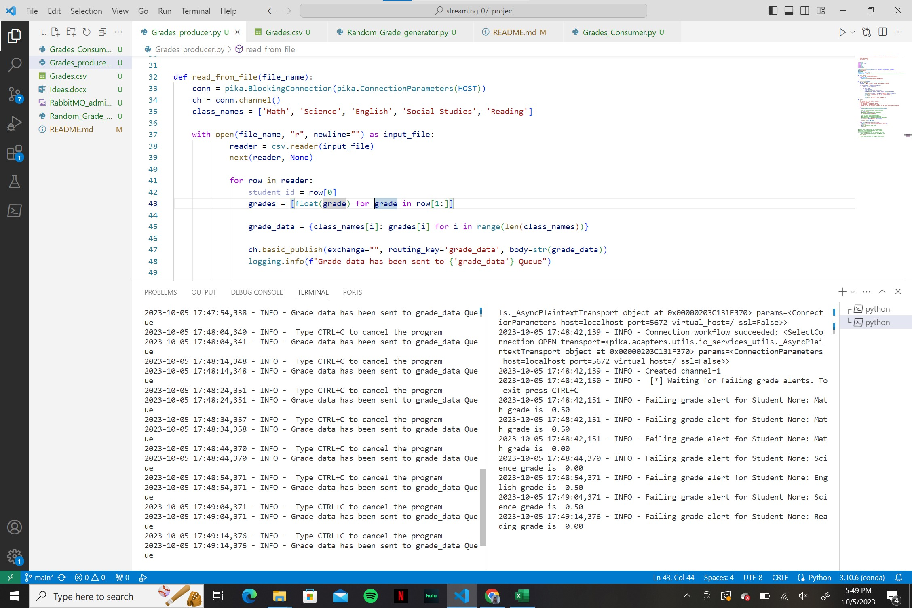
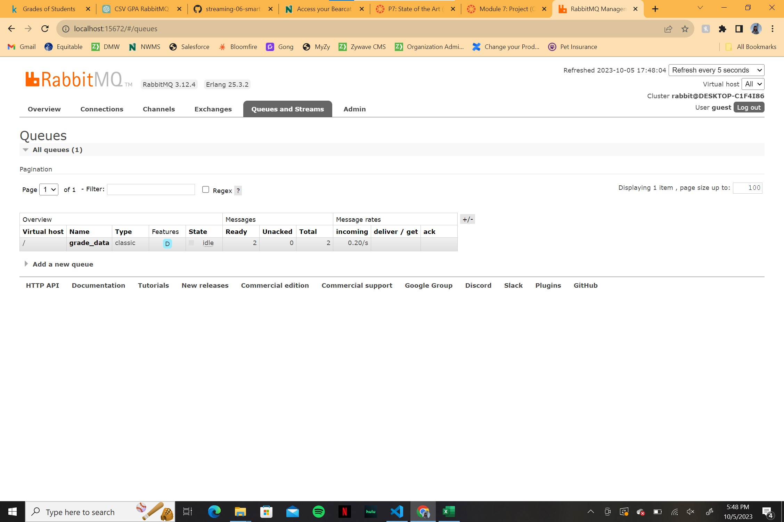

# streaming-07-project
> Use RabbitMQ to distribute class grades readings to a specific channel and have that worker channel alert the user when a grade is below the failing threshold.

## Pre-requisites
Make sure the following are installed on your system:
1. pika
1. sys
1. webbrowser
1. time
1. logging
1. datetime

## Before You Begin
Make sure you are in your conda environment. Ensure pika and pandas are installed and updated with the following codes: 

        conda install -c conda-forge pika
        conda install -c conda-forge pandas

## Goal of Project
The goal of this project is to allow teachers/counselors to input large quantities of student data and have the program indicate to them which students are failing classes and what those specific classes are. As a former teacher, I am very passionate about the education system and I have firsthand knowledge of what it is like to be an educator. This project was inspired by my desire to make teachers lives a bit easier and automated.

## Data Origin
The origin of this data was created by writing a program that produced random student grades. This file is called "Random_Grade_generator.py". 

## Producer Notes/Comments
This project was built after BBQ_produer.py from module 5. A copy was made made and adjusted to meet the needs of the problem on hand. 

After listing imports and main variables, the individual programs were defined. 

1. "def rabbit_admin" was used to automatically open the RabbitMQ admin website. Show offer is currently set to "True" which automatically opens the website, however it can be set to Flase if you would like the option to open it or not.
1. "def read_from_file" is used to read data from a pre-determined file. The chosen file must be listed next to the "FILE_NAME_TASKS" variable. This program also makes sure each piece of data goes to the correct channel and tells the program to read one value every 10 seconds.
1. "def main()" is used to bring all the defined programs under one main function.

The python idiom was then used to ensure the functions were only called if this is actually the program being executed. In this case, the function being called was:
1. main()

Due to the 10 second time limit between readings, a user may hit CTRL-C to cancel the program at anytime. 

## Consumer Notes/Comments
This project was built after BBQ_consumer.py from module 6. A copy was made and adjusted to meet the needs of the problem on hand. 

After listing imports and main variables, the individual programs were defined. 

1. "def callback_message" was used to describe the alert that will be sent if a specific threshold is met. In this case, the failing threshold for the school is set at a 1.0. When a grade is below that threshold, the consumer sends an alert indicating that the student has failed the specific class. This can be adjusted to meet the threshold of individual school systems.
1. "def main()" is to connect to RabbitMQ, declare the connection, consume the message, and produce the necessary alert given the information being consumed. 

The python idiom was then used to ensure the functions were only called if this is actually the program being executed. In this case, the function being called was:
1. main()

## Problems
In the case of this project, I had difficulty getting the message to properly present the StudentID. The initial way it was coded resulted in a consistent error indicating that I was attempting to use tuples for an expression where tuples could not be used. This resulted in rewriting the expression in the producer file to store each row as a dictionary. However, while the error went away, the consumer presents each studentID as "NONE". This is not something I have been able to figure out.

## Example photos.

The picture below will show what an active terminal will look like when these programs are running in conjuction with each other.

The picture below will show what the RabbitMQ admin site will look like when this program is running.

